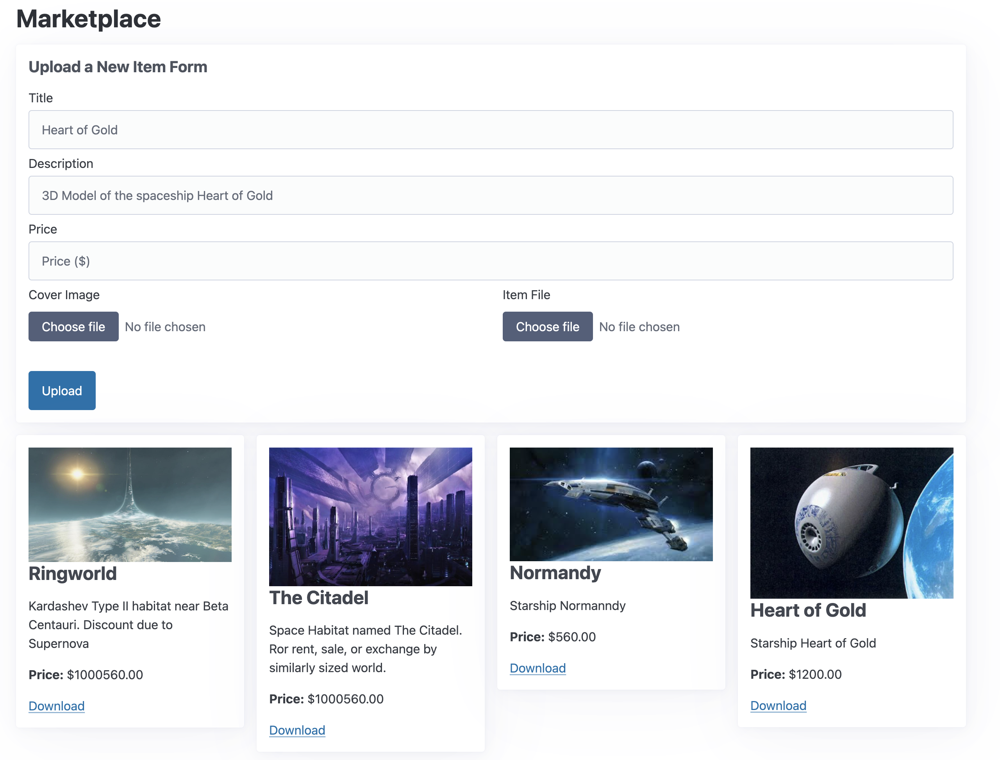

# FastHTML Marketplace with L402 Integration

This example demonstrates a digital marketplace built using FastHTML, with L402 protocol integration for secure, pay-per-download functionality.



Features:
- Upload and list digital items for sale
- Responsive grid layout using Flexbox
- L402 protocol integration for secure, pay-per-download functionality
- SQLite database for storing item information
- File upload and storage for item cover images and downloadable files

How it works:
1. The app uses FastHTML to create a responsive web interface.
2. Items are stored in a SQLite database using the `database` function.
3. The main page displays an upload form and a gallery of items.
4. Users can upload new items with a title, description, price, cover image, and downloadable file.
5. The L402 protocol is implemented for the download functionality:

```python
@rt("/download/{id:int}", methods=["GET"])
@FastHTML_l402_decorator(authenticator, lambda req: (100, 'USD', 'Download of an item'))
async def download_file(req, id: int):
    item = items.get(id)
    if not item or not item.file_path:
        return PlainTextResponse("File not found", status_code=404)
    file_path = item.file_path
    if not os.path.exists(file_path):
        return PlainTextResponse("File not found", status_code=404)
    return FileResponse(
        file_path,
        filename=os.path.basename(file_path),
        media_type='application/octet-stream'
    )
```

6. When a user attempts to download an item, they are required to pay using the L402 protocol before accessing the file.

Setting up:
1. Install the required dependencies (FastHTML, L402, etc.)
2. Set up a Fewsats account and obtain an API key
3. Export your Fewsats API key as an environment variable:
   ```
   export FEWSATS_API_KEY=fs_your_api_key_here
   ```
4. Run the application:
   ```
   python main.py
   ```

Key Components:
- `FewsatsInvoiceProvider`: Handles invoice creation for L402 payments
- `SqliteMacaroonService`: Manages authentication tokens using SQLite
- `Authenticator`: Implements the L402 protocol for secure downloads
- `FastHTML_l402_decorator`: Protects the download route with L402 authentication

This example showcases how to build a functional digital marketplace with secure, pay-per-download functionality using FastHTML and the L402 protocol.